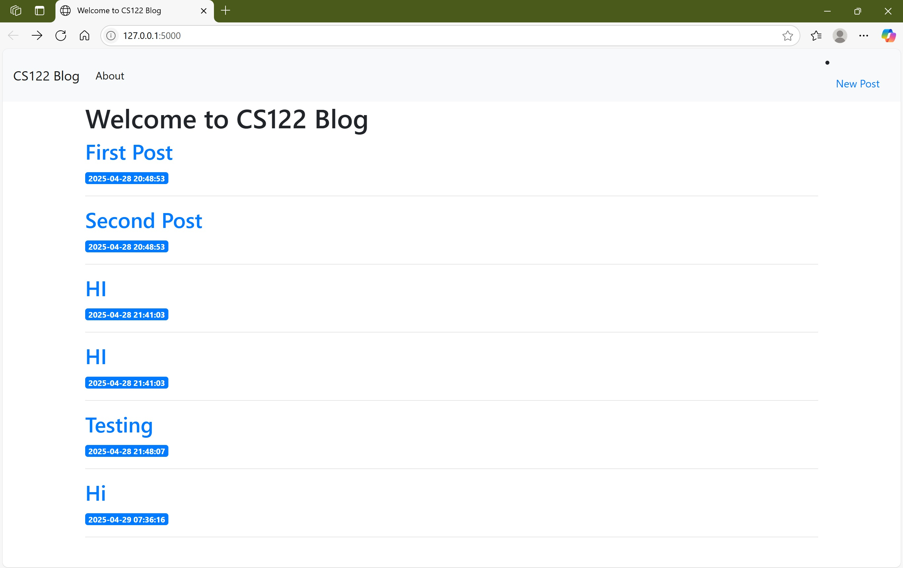
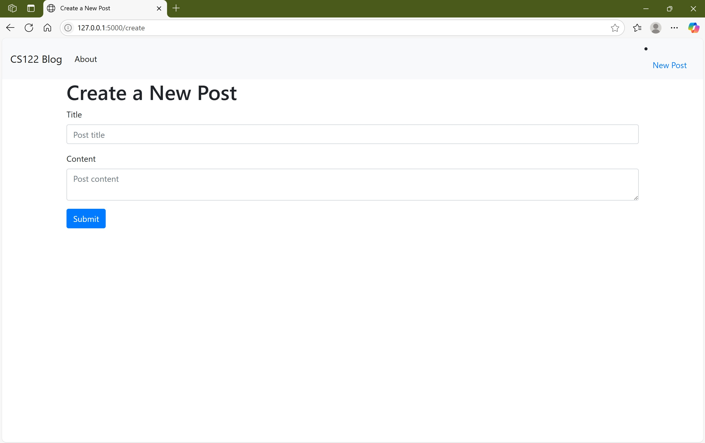

# Flask App
This mini project is I worked on to help my classmate for their CS 122 class.

How to Run the Code
1. Download all the necessary files from GitHub including: entire data folder, templates folder, app.py file, init_db.py file, requirements.txt, and schema.sql file.
2. Make sure to install DB Browser SQLite on computer.
3. Run app.py in terminal. py app.py in windows.
4. Output

